# Integrative Project: Create your own layout with Cubic
**Student:** Paula Simbaña

**University:** International University of Ecuador (UIDE)

**Major:** Systems Engineering - Second Semester

**Date:** June 23, 2026

## 1. Base System Used
* **Base Operating System:** Ubuntu 24.04 LTS (Noble Numbat), 64-bit architecture (x86_64).

* **Customization Tool :** Cubic (Custom Ubuntu ISO Creator). This tool was used to extract and modify the original Ubuntu ISO image. Using the chroot environment, changes were made directly to the root filesystem, including package installation, desktop environment customization, and initial system configuration. Once the modifications were complete, Cubic allowed the distribution to be recompiled and the final bootable ISO image to be generated.

The resulting custom distribution was named PaulaOS, developed as part of the course's integrated project, maintaining the stability and compatibility of Ubuntu 24.04 LTS while incorporating configurations and tools adapted to the project's requirements.

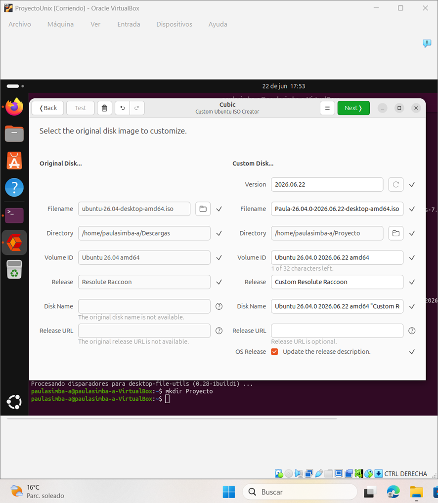

## 2. List of Modifications and Justification

## Modification 1: Replacement of System Multimedia Software :** 

* **What was done:** Within the Cubic chroot environment, the repositories were updated with apt update and the mpv multimedia player was installed along with its native dependency libraries.

* **Justification:** Resource and performance optimization. Unix environments geared towards servers or development do not require heavy multimedia players or those with redundant graphical interfaces. The inclusion of mpv offers a minimalist, high-performance alternative that consumes less RAM and CPU cycles on the operating system.

> *Note: Initially, the package manager returned a localization error due to a reversal in the letter order ("mvp"), which was corrected and successfully installed as mpv.* 

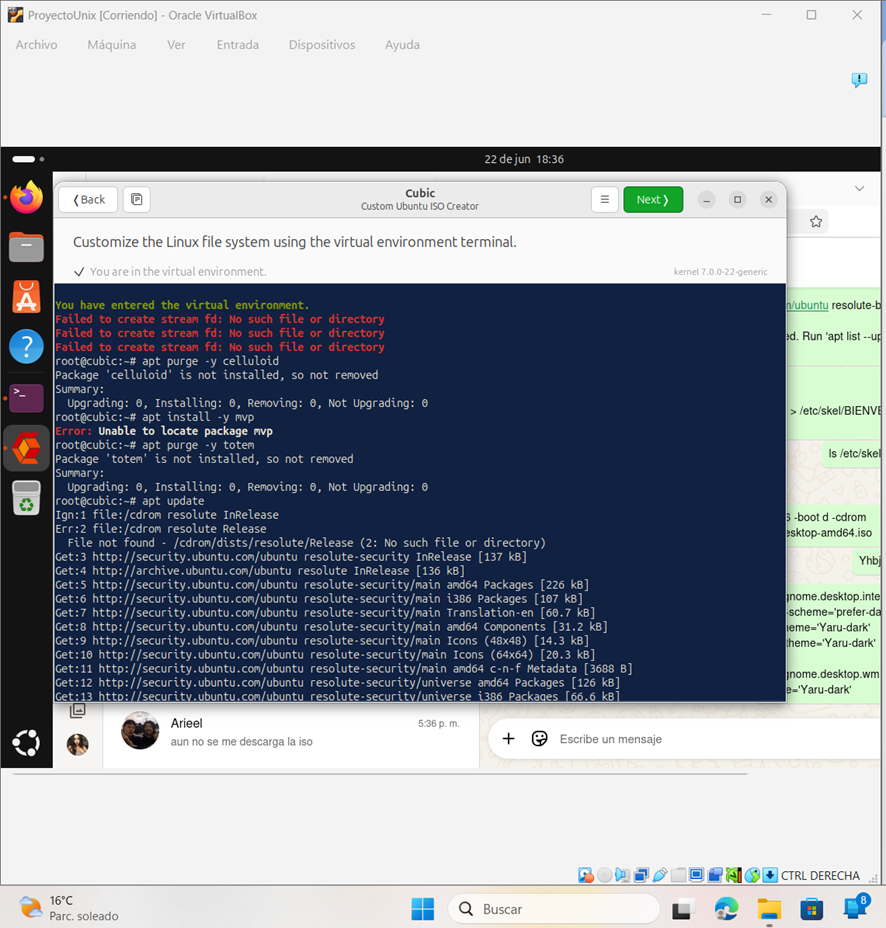

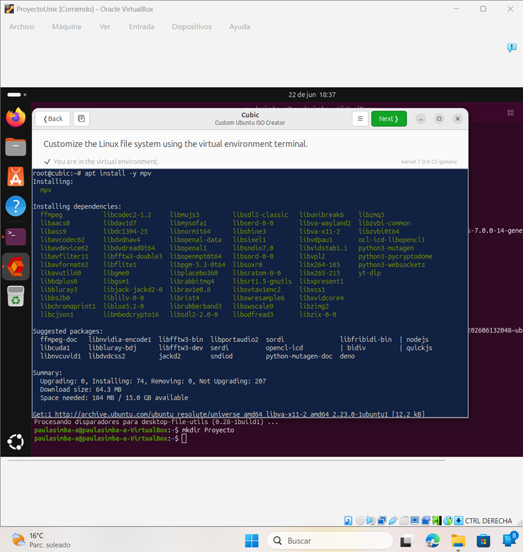

### Modification 2: Implementation of Native Programming Tools
* **What was done:** Essential software development tools were injected into the system root: the advanced text editor neovim and the metapackage build-essential (which installs the gcc and g++ compilers and the makeutility).

**Justification:** Autonomy of the development environment. By integrating these packages directly into the ISO compilation, we ensure that any developer can write, edit, and compile code in languages ​​like C or C++ natively and immediately from the first boot, eliminating the dependency on a post-installation internet connection.

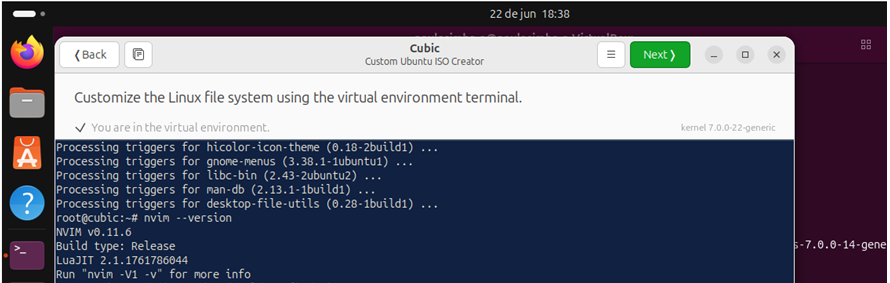

### Modification 3: Customizing the Terminal and Neovim using `/etc/skel`

* **What was done:** We modified the /etc/skel folder, which is the template ("skeleton") that Linux uses to create any new user or boot the temporary session from the Live CD. We made two configurations:

1. **Neovim configuration:** We used the cat redirection command to create the /etc/skel/.config/nvim/init.lua file. There, we enabled normal and relative line numbering (vim.opt.number and vim.opt.relativenumber), enabled mouse support, set tabs to 4 spaces, and programmed a confirmation message in the status bar. 

2. **Terminal Aliases:** Using echo commands, we added permanent shortcuts within the .bashrc file: the alias ll (to view a detailed list of files in color) and the alias c (to clear the screen with the clear command).

* **Justification:** Automating the development environment. By making these changes directly to the base template /etc/skel, we avoid having to manually configure preferences each time the system starts in test mode or a new user is created, ensuring the tools are ready for programming from the very beginning.

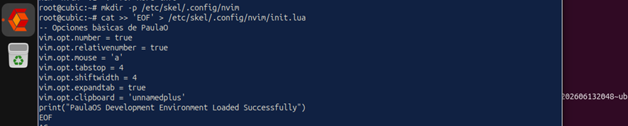

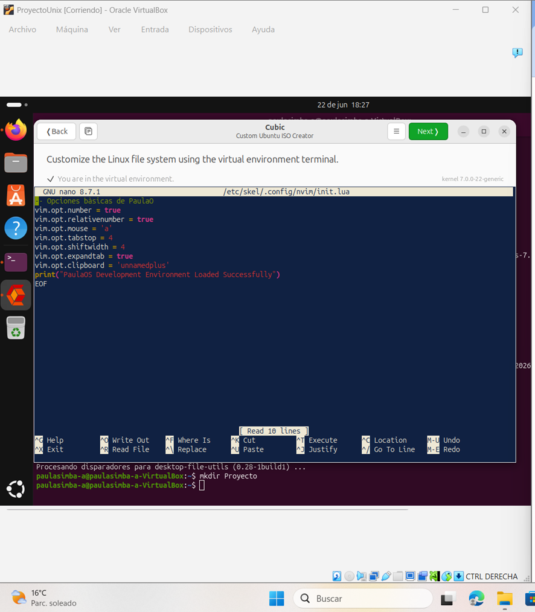

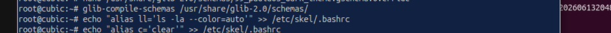

### Modification 4: Automating the Graphical Interface Profile
* **What was done:** We created a configuration file in the path /usr/share/glib-2.0/schemas/99_paulaos_dark_theme.gschema.override using the nano editor. There, we defined the system to use dark mode by default (prefer-dark and Yaru-dark). Finally, we ran the command glib-compile-schemas so that the operating system would save and apply the change.

* **Justification:** Control and customization of the system from the ground up. Instead of manually changing the theme in the settings after the system is installed, making this change directly in the operating system's configuration files ensures that the entire graphical environment (including the Ubuntu installer) loads in dark mode automatically from the first boot, leaving the interface ready and customized for the user.

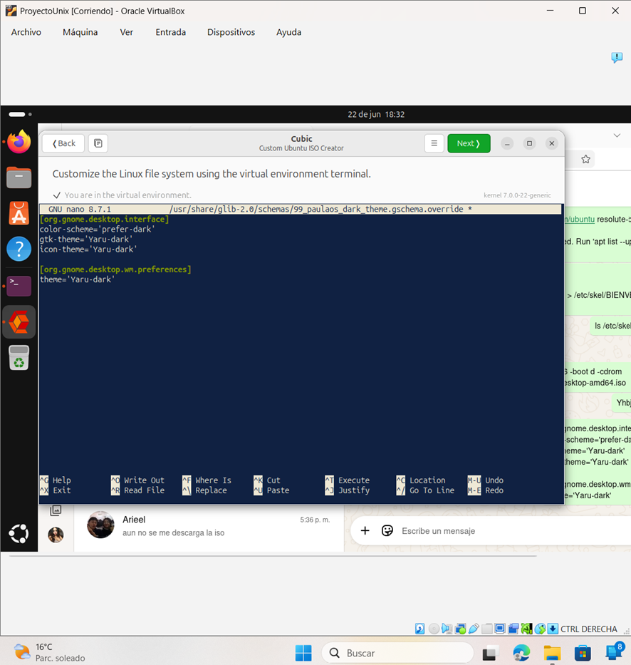

### Extra Modification: Storage Debugging and Optimization
* **What was done:** Before closing the chroot cage and compiling the ISO, a filesystem debugging routine was run using the commands apt autoremove -y, apt clean, and recursive removal of temporary files in /var/lib/apt/lists/ and /tmp/.

* **Justification:** Storage resource optimization. Deep cleaning removes unnecessary caches and downloaded packages, significantly compressing the final size of the read-only filesystem and lightening the ISO image.

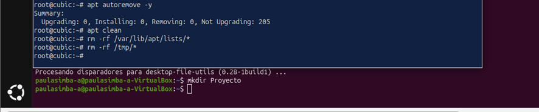

## 3. Boot Process Evidence
The following shows the initialization sequence of the **PaulaOS** ISO within VirtualBox, along with functionality tests in the environment:

### Step 1: Linux Kernel Initialization
When the virtual machine starts with our ISO, the operating system begins mapping and recognizing the virtual hardware components. It is verified that it passes the checks stably and cleanly, without generating kernel panics.

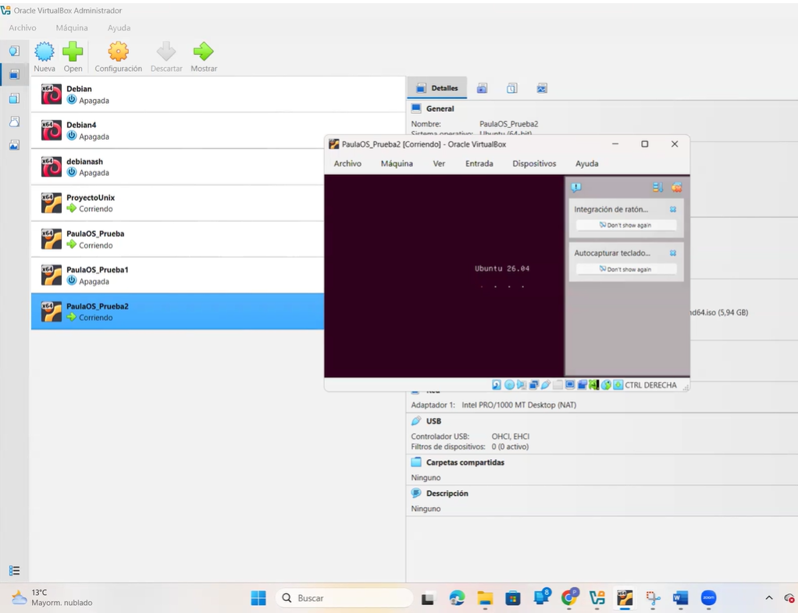

### Step 2: Graphical Loading Screen
The graphical environment boots successfully, displaying the official Ubuntu boot logo. This confirms that the Cubic compressed read-only file system and packaging did not suffer data corruption.

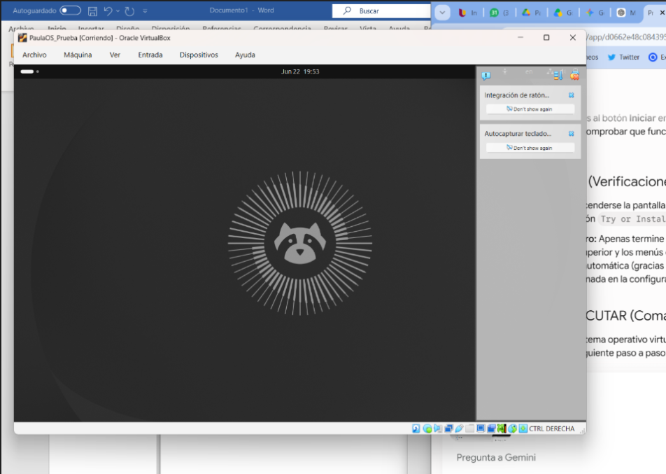

### Step 3: Welcome Interface and Dark Theme Persistence
The initial Ubuntu wizard deploys successfully. Here, the effectiveness of our Modification 4 is verified: the entire installer and visual elements automatically adopt the native Dark Mode without user intervention.

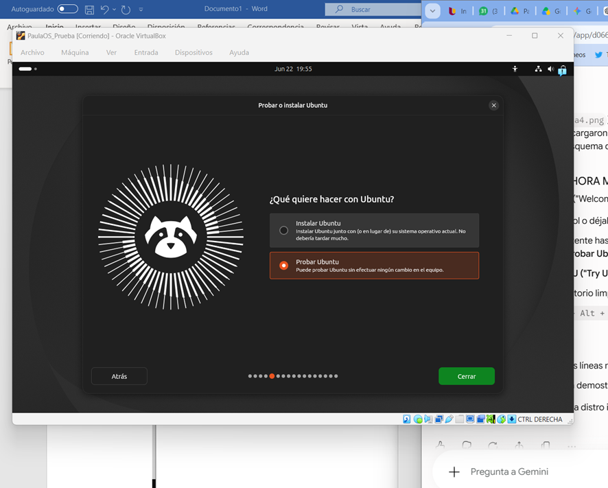

### Step 4: Validating Modifications in the Terminal (Active Environment)

Once inside the test environment desktop, we open the operating system terminal to validate that all our previous configurations load correctly:
1. **Test of Modification 1 (mpv):** When executing the command mpv --version, the console responds correctly, displaying information about the installed binaries.

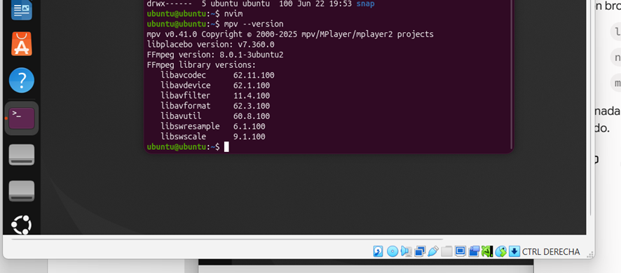

2. **Test of Modification 2 (neovim):** By starting the code editor with nvim, it is verified that the program has native compilation support.

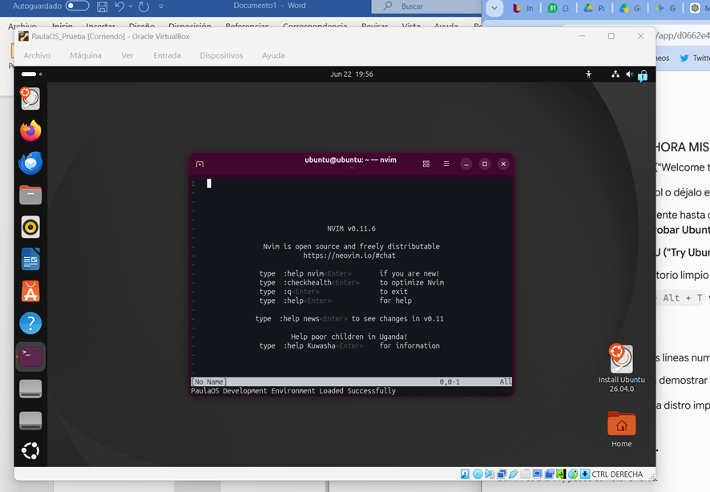