# Part 2 - Build a 64-bit Kernel
**Student:** Ashley Espinoza

**University:** International University of Ecuador (UIDE)

**Major:** Systems Engineering - Second Semester

**Date:** June 24, 2026

This folder contains the files for Part 2 of the integrative project.
The objective is to build a minimal 64-bit kernel that boots in QEMU using GRUB and Multiboot2.

## Step 0 - Repository setup

In this step, I prepared the project repository in my Ubuntu virtual machine.

I first verified that Git was available in the system. After that, I moved to my personal workspace and cloned the group repository from GitHub. I used the project branch called `integrative-project`, because this is the branch where my group is organizing the integrative project.

After cloning the repository, I entered the project folder and checked the active branch. The terminal confirmed that I was working inside the `integrative-project` branch.

This step is important because it connects my local Ubuntu environment with the group repository. From this point, I will create and test all files for Part 2 inside the `part2` folder. Later, I will save my changes with commits and upload them to GitHub.

### Evidence
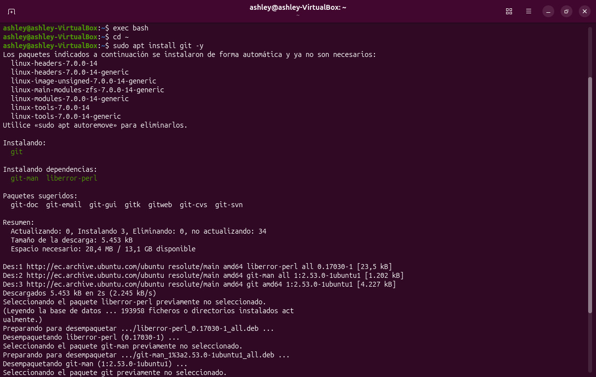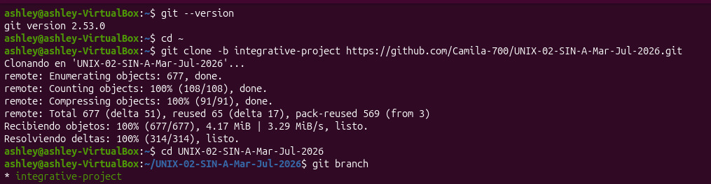

## Step 1 - Local environment preparation

## Step 1 - Local environment preparation

In this step, I prepared my Ubuntu virtual machine for the kernel development process. I installed and verified the main tools needed for Part 2. These tools are Docker, QEMU, Make, and Tree.

This step is important because the kernel needs a local Linux environment to build and test correctly. Docker will help me create a reproducible build environment. QEMU will help me boot and test the generated ISO file. Make will help me automate the compilation process.

After the installation, I checked the versions of the tools in the terminal. The output confirms that my environment is ready to continue with the 64-bit kernel build.

### Evidence
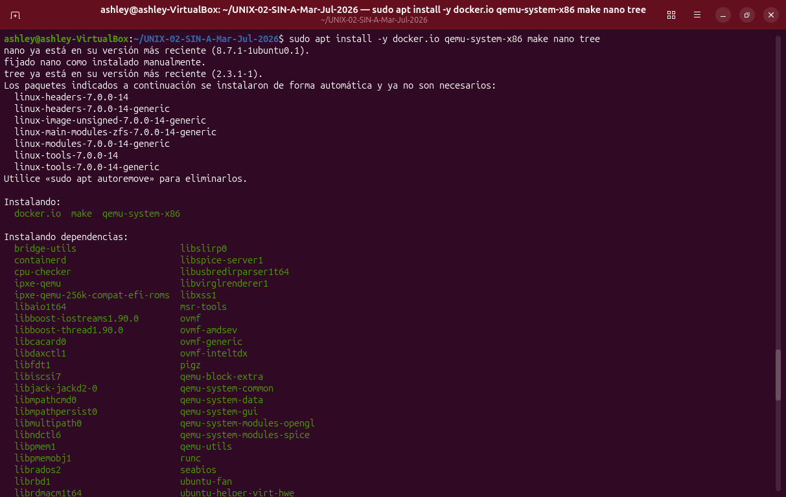
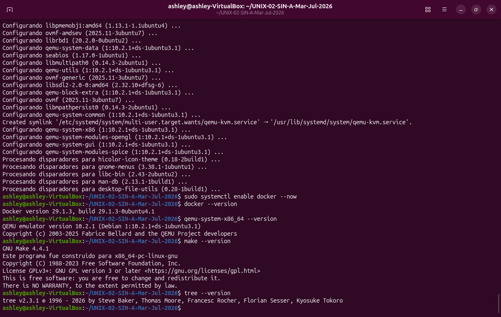

## Step 2 - Docker build environment

In this step, I created the Dockerfile for Part 2 of the project.

This file is located inside the `part2` folder. The Dockerfile prepares the build environment for the 64-bit kernel.

I used a Docker image with the x86_64 cross compiler as the base. Then, I added the required tools for the kernel build process, such as NASM, GRUB, xorriso, mtools, and Make.

This step is important because the project requires a reproducible build environment. With Docker, the kernel can be compiled using the same tools every time, even on another computer.

### Evidence
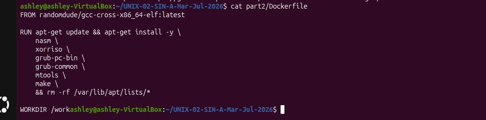

## Step 3 - Makefile creation

In this step, I created the Makefile for Part 2.

The Makefile is located inside the `part2` folder. This file organizes the build process for the kernel.

The Makefile will assemble the boot files, compile the C file, link all object files, and generate the final bootable ISO.

This step is important because it makes the project easier to build. Instead of running many separate commands manually, the build process is controlled from one file.

The Makefile also includes a verification option to check if the generated kernel is compatible with Multiboot2. This is required because GRUB needs to recognize the kernel before it can boot it.

### Evidence
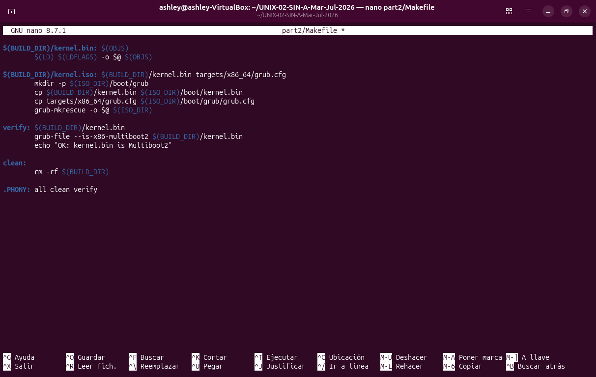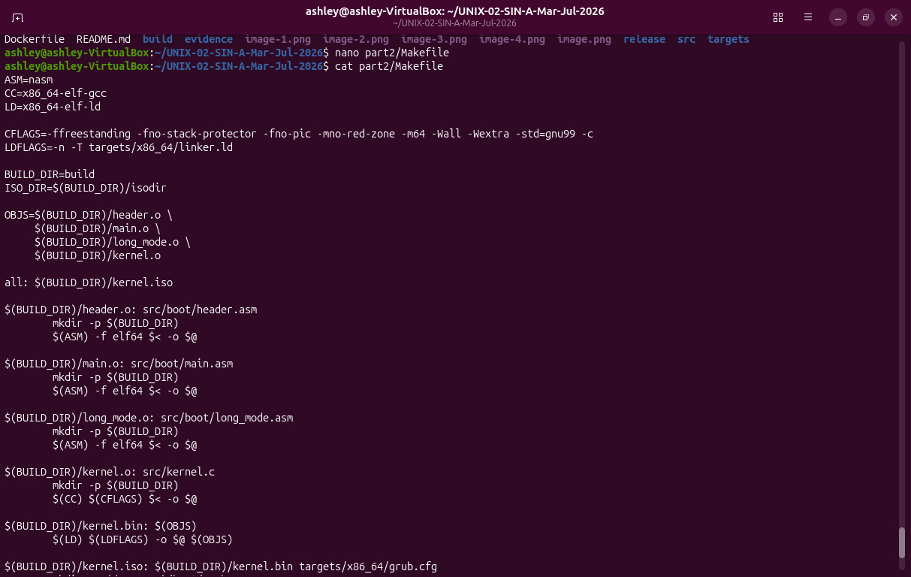

## Step 4 - Linker and GRUB configuration

In this step, I created the linker script and the GRUB configuration file.

The linker script is located in `targets/x86_64/linker.ld`. This file defines how the kernel sections are organized in memory. It places the kernel at 1 MB and keeps the Multiboot2 header at the beginning of the boot section. This is important because GRUB needs to find the Multiboot2 header when it loads the kernel.

The GRUB configuration file is located in `targets/x86_64/grub.cfg`. This file defines the boot menu entry for the kernel. It tells GRUB to load `/boot/kernel.bin` using Multiboot2.

This step prepares the project so the kernel can be linked correctly and later loaded by GRUB inside the bootable ISO.

### Evidence
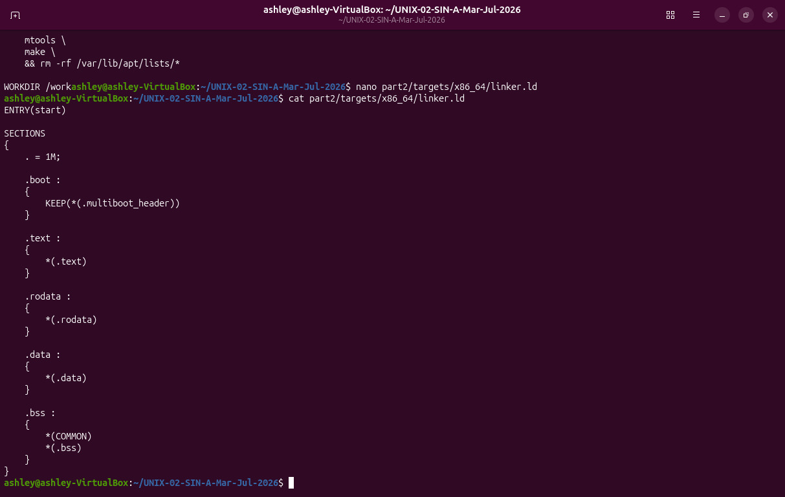
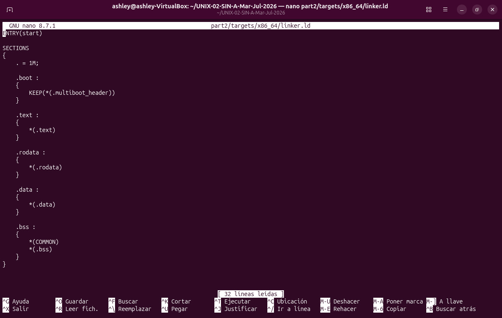

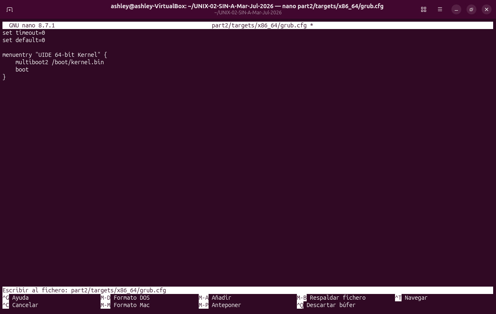
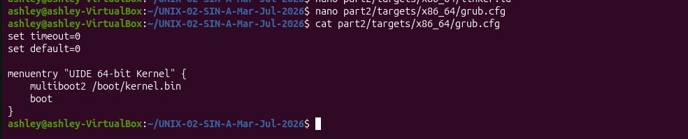

## Step 5 - Multiboot2 header

In this step, I created the `header.asm` file inside `src/boot`.

This file contains the Multiboot2 header. This header is required because GRUB needs to identify the kernel before loading it.

The header includes the Multiboot2 magic number, the architecture field, the header length, and the checksum. These values help GRUB validate the kernel file during the boot process.

This step is important because without a valid Multiboot2 header, GRUB would not load the kernel correctly.

### Evidence
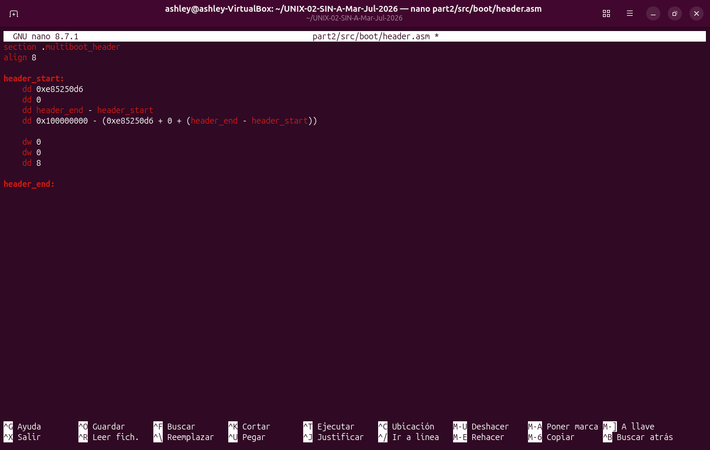

## Step 6 - Main boot assembly

In this step, I created the `main.asm` file inside `src/boot`.

This file contains the main boot process of the kernel. The kernel starts in 32-bit protected mode because GRUB loads it in that state.

In this file, I prepared the stack and added the required checks before entering 64-bit mode. I checked Multiboot2, CPUID, and long mode support.

After the checks, I created the page tables and identity mapped the first 1 GB of memory. Then, I enabled paging, loaded the 64-bit GDT, and jumped to the 64-bit entry point.

This step is one of the most important parts of the project because it prepares the transition from 32-bit mode to 64-bit long mode.

### Evidence
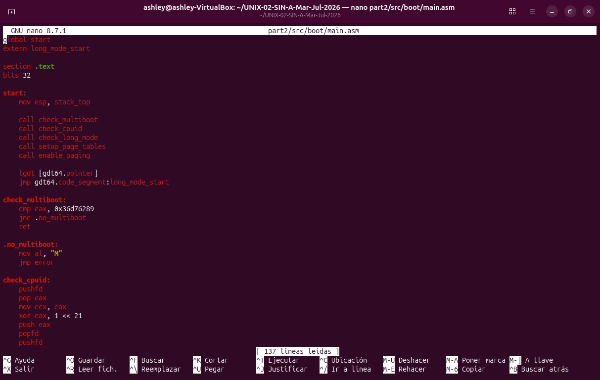

## Step 7 - Long mode entry

In this step, I created the `long_mode.asm` file inside `src/boot`.

This file contains the first code that runs after the kernel enters 64-bit long mode.

The code clears the segment registers and then calls `kernel_main`, which is the main function written in C.

After calling the C code, the kernel enters a halt loop. This keeps the system stable and prevents the CPU from executing random memory after the kernel finishes printing the message.

This step connects the assembly boot process with the C kernel code.

### Evidence
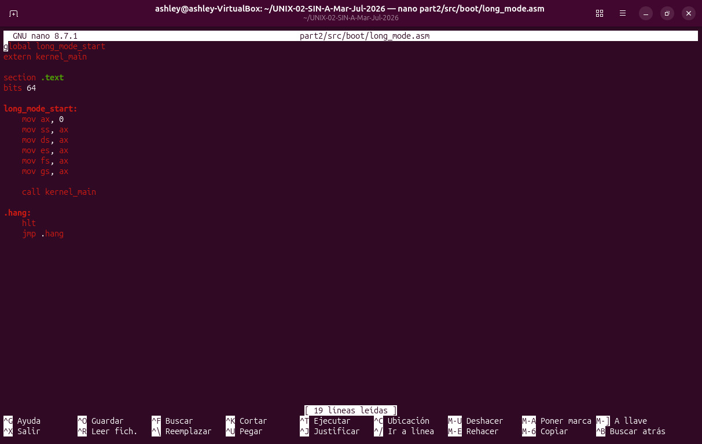

## Step 8 - C kernel print function

In this step, I created the `kernel.c` file inside the `src` folder.

This file contains the C code that runs after the kernel enters 64-bit long mode. The assembly file `long_mode.asm` calls the function `kernel_main`, and this function starts the C part of the kernel.

In `kernel.c`, I created simple functions to work with VGA text memory. The kernel writes directly to memory address `0xb8000`, which is used for text output in VGA mode.

The function `clear` cleans the screen. The function `set_color` changes the text color. The function `print_str` prints a string on the screen.

This step is important because it proves that the kernel reached 64-bit mode and executed C code correctly. The final result will show the group message in QEMU.

### Evidence
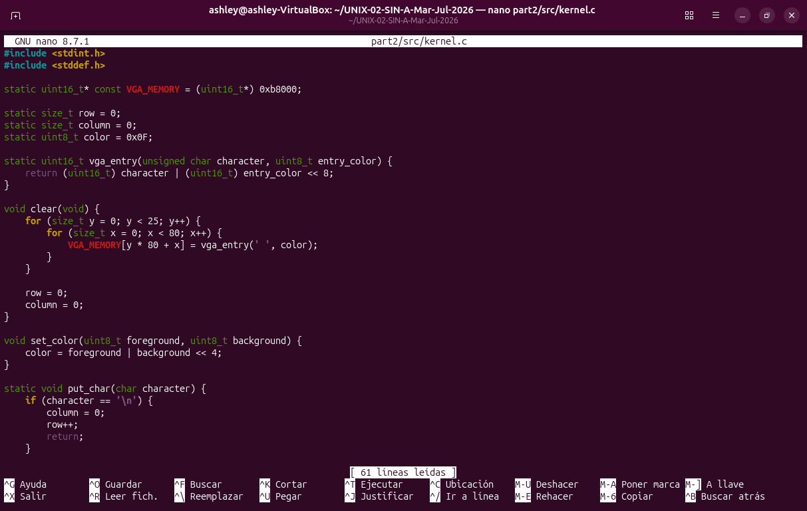

## Step 9- Docker image build

In this step, I built the Docker image for the kernel project.

The Docker image uses the Dockerfile created in Part 2. This image includes the tools needed to build the kernel, such as the x86_64 cross compiler, NASM, GRUB, xorriso, mtools, and Make.

This step is important because it creates a reproducible build environment. The kernel will not depend only on the packages installed in my Ubuntu virtual machine. Instead, the build process will run inside Docker with the required tools.

After building the image, I verified that the image `uide-kernel-build` was created successfully.

### Evidence
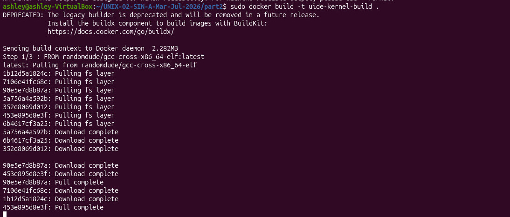
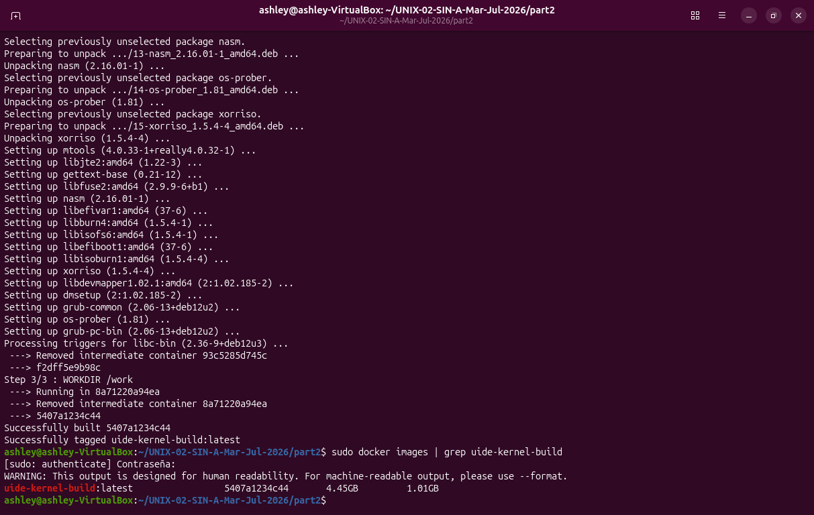

## Step 10 - Kernel ISO build

In this step, I compiled the 64-bit kernel inside the Docker environment.

The build process used the Makefile. It assembled the boot files, compiled the C kernel file, linked all object files, and generated the final bootable ISO.

The final file is `build/kernel.iso`.

This step is important because it proves that the source code can be compiled into a bootable kernel image.

### Evidence
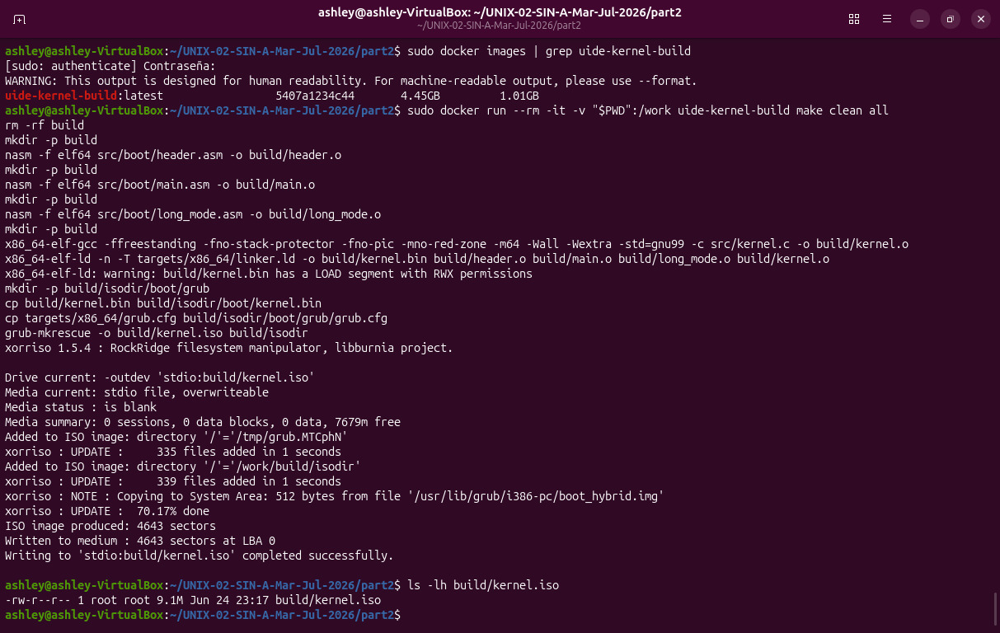

## Step 11 - Multiboot2 verification

In this step, I verified that the generated kernel is compatible with Multiboot2.

This verification is important because GRUB needs to recognize the kernel before it can boot it.

The result confirmed that `kernel.bin` is a valid Multiboot2 kernel.

### Evidence

## Step 12 - QEMU boot test

In this step, I tested the generated kernel ISO in QEMU.

QEMU opened a virtual machine and loaded the `kernel.iso` file. GRUB loaded the kernel using the Multiboot2 configuration.

The kernel booted correctly and printed the custom group message on the screen.

This step is important because it proves that the kernel was compiled, loaded by GRUB, and executed successfully in 64-bit long mode.

### Evidence
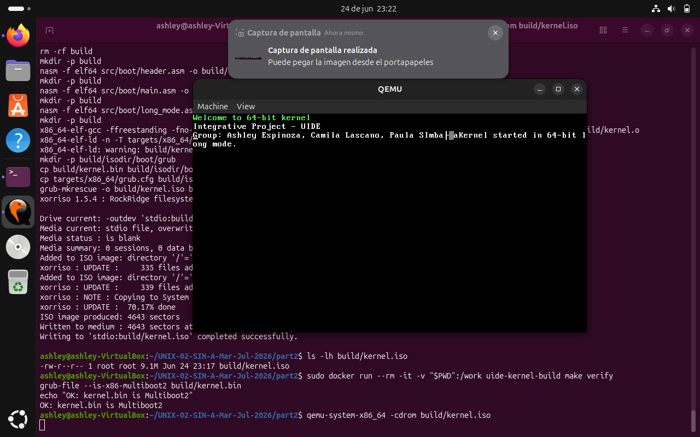

## Step 13 - Release and checksum

In this step, I copied the final generated ISO to the `release` folder.

The final ISO is saved as `release/kernel.iso`. I also generated a SHA256 checksum file named `kernel.iso.sha256`.

This step is important because the release folder contains the final file that can be tested or submitted. The checksum helps verify that the ISO file was not changed or corrupted.

### Evidence
